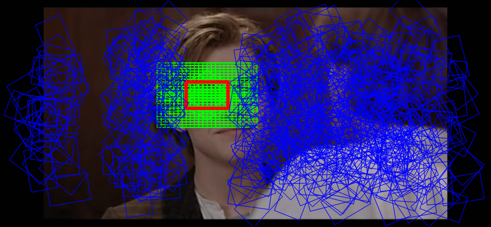

# SignProcessing

# 效果

输入图片为

输出到 sgn（路牌切片）、pos（正样本）、neg（负样本）三个文件夹内。（见 `data` 文件夹）

切片选取位置参考

，其中红色为切片选区，绿色为正样本区域，蓝色为负样本区域。

## 说明文档

<http://gnat.qiniudn.com/homework/SignProcessing_README.pdf>

## 模块

包括：

* SignCutter（路牌提取）
* SignTransformer（直接对切片区域变换：平移、镜像、旋转）
* SignLogger（记录切片区域，在原图上变换，效果更好）
* SignClassifier（分类）
* etc.

## Binary Release

动态链接 OpenCV 和 Qt，如果没有配置安装 Qt4 和 OpenCV2，
需要的下载 dll：<http://gnat.qiniudn.com/homework/dlls-qt-opencv.7z>
如果还是不能运行，就下载：<http://gnat.qiniudn.com/homework/dlls-full.7z>，
把下载后的 dll 放在程序一起即可运行。

## 手工编译

0. 需要 Qt4，OpenCV 库，以及 CMake。
1. cmake 产生 VS2010 工程；
2. 用 VS 编译。

## Envs

Env | Env Value
--- | ---
OpenCV | `C:\dev\OpenCV\build`
OpenCV_Dir | `%OpenCV%`
QTDIR | `C:\Qt\qt-4.8.6-x64-msvc2010\qt-4.8.6-x64-msvc2010`
PATH | `%PATH%;%QTDIR%\bin;%OpenCV%\x64\vc10\bin;`

## 成员

* 组长：ZhaoPengcheng
* 成员：（拼音排序）
    + Guochen
    + Liaoyanyan
    + Liuxuan
    + TangZhixiong
    + WangJinyi
    + ZhangYuan
    + ZhaoPengcheng

## Acknowledgements

感谢 LiYinYuan 师姐的参考程序。

## @GitHub

[district10/SignProcessing](https://github.com/district10/SignProcessing)